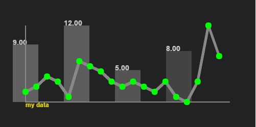
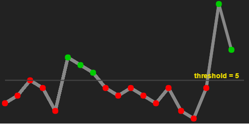
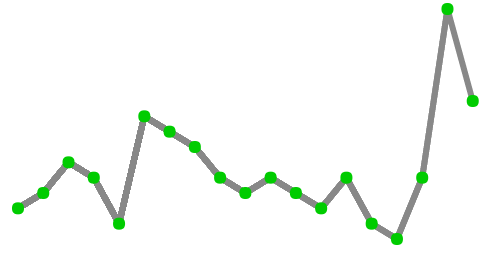

## simpleplot
Javascript module to create simple plots.
- No dependencies
- Interactive (hover over data point for value)
- Customizable
Optionally add a threshold line; points above the threshold can be colored differently than below. This is useful if you want to indicate which datapoints reach a certain target level (e.g., how many push-ups you performed per day)

Sample implemenations: http://mcmonty2600.github.io/simpleplot/

### Screenshots




### Basic Example

In the simplest case, a data plot is created by passing in a canvas element and an array of numbers, without additional configuration parameters 
```
<script>
  data = [2,3,5,4,1,8,7]];
  simpleplot(c3, data);
</script>
```


### Configuration 

Each simpleplot istance can be customized by passing in configuration parameters to overwrite default values.

| Parameter | Default | Description |
| ------------- | ------------- | ------------- |
| plotType | 'line' | String describing plot type. Options are empty string (defaults to a line/scatter plot) and 'bar'  |
| font     | 'bold 14px Arial' | String describing font |
| xStart   | 10               | x start location with respect to canvas element |
| yStart   | canvas.height-10 | y start location with respect to canvas element |
| width    | canvas.width-20  | Width in pixels  |
| height   | canvas.height-20 | Height in pixels |
| numPoints | array length | Number of points to plot (can be greater than length of array) |
| axes | object | Object with attributes for color and line thickness of axes, default: ```{enable:false, color:'#888', thickness:2}``` |
| caption | object | object with text and text color, default: ```{enable:false, text:'', textColor:'#888'}``` |
| points | object | default: ```{enable : true, color:'#0c0', radius:6}``` |
| lines | object | default: ```{enable:true, color:'#888', thickness:6}``` |
| values | object | default: ```{enable:false, textColor:'#888', formatValuesFunction:undefined}``` |
| threshold | object | see table below |
| hover | object | default: ``` enable:true, color:'yellow', formatHoverInfoFunction:undefined``` |
